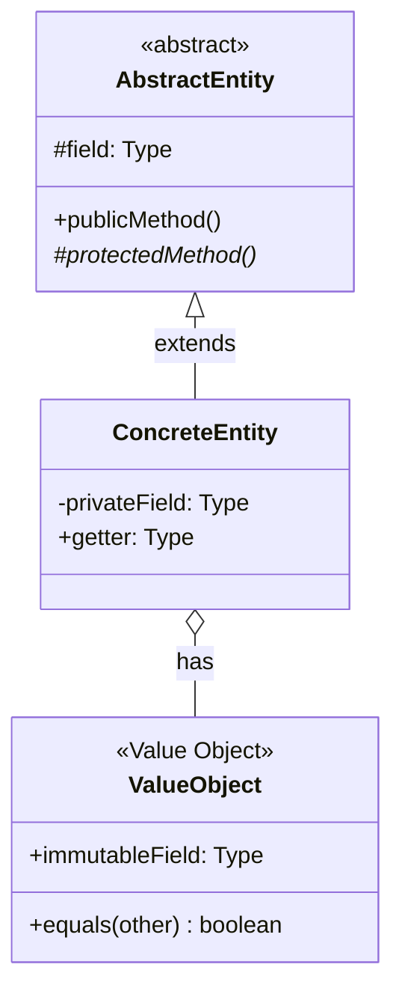

# 객체지향 도메인 설계

> 협력 시나리오 → 메시지 추출 → 책임 할당 → Entity/VO 구현

## 핵심 원칙

```
협력이 먼저, 메시지가 객체를 선택, Tell Don't Ask
```

## 설계 Flow

```
Phase 1: 분석 → Phase 2: 설계 → Phase 3: 구현 → Phase 4: 테스트 → Phase 5: 검증
    │              │              │              │              │
    ↓              ↓              ↓              ↓              ↓
 협력 시나리오   책임 할당      Entity/VO     Red-Green     안티패턴
 메시지 추출   인터페이스     Factory/Repo   Refactor     체크리스트
```

## Phase 1: 분석

**목표**: 협력 시나리오 작성, 메시지 추출

1. 유스케이스 선택
2. 협력 시나리오 작성 (자연어)
3. 메시지 추출 (동사 → 메시지)
4. 정보 전문가 식별

```
시나리오 예시:
1. 사용자가 상품을 장바구니에 담는다
2. 시스템이 주문 항목을 생성한다 → createOrderItem()
3. 시스템이 할인 정책을 적용한다 → applyDiscount()
4. 각 항목이 금액을 계산한다 → calculateAmount()
```

**상세**: [docs/domain-design/phases/01-analysis/](../../docs/domain-design/phases/01-analysis/)

## Phase 2: 설계

**목표**: GRASP 패턴으로 책임 할당, 인터페이스 정의, **클래스 다이어그램 시각화**

### 2-1. 클래스 다이어그램 작성 (필수)

설계 단계에서 반드시 Mermaid 클래스 다이어그램으로 엔티티 구조를 시각화한다.



**다이어그램 규칙:**
- `<<abstract>>`, `<<Value Object>>` 스테레오타입 명시
- `#` protected, `-` private, `+` public
- `*` 추상 메서드
- 관계: `<|--` 상속, `o--` 합성, `*--` 컴포지션

**저장 위치:** plan 파일 **AND** `entity/DESIGN.md` 둘 다 작성 (필수)

### 2-2. GRASP 패턴 적용

| 패턴 | 질문 |
|------|------|
| 정보 전문가 | 이 정보를 누가 가지고 있는가? |
| 창조자 | 이 객체를 누가 생성해야 하는가? |
| 다형성 | 조건문을 다형성으로 대체할 수 있는가? |
| 변경 보호 | 변경 지점을 인터페이스로 보호했는가? |

### 2-3. 책임 할당

```typescript
// 정보 전문가에게 책임 할당
// ❌ 외부에서 계산
const total = order.getSubtotal() - order.getDiscount();

// ✅ 정보를 가진 객체가 계산
const total = order.calculateTotal();
```

**상세**: [docs/domain-design/phases/02-design/](../../docs/domain-design/phases/02-design/)

## Phase 3: 구현

**목표**: Entity, Value Object, Aggregate, Factory, Repository 구현

### Entity vs Value Object

| 특성 | Entity | Value Object |
|------|--------|--------------|
| 식별자 | 있음 (ID) | 없음 |
| 가변성 | 가변 가능 | **불변** |
| 비교 | 동일성 (===) | 동등성 (equals) |
| 예시 | Order, User | Money, DateValue |

### Value Object 구현

```typescript
class Money {
  private readonly amount: Decimal;

  constructor(amount: number) {
    if (amount < 0) throw new Error('음수 불가');
    this.amount = new Decimal(amount);
  }

  // 불변: 새 객체 반환
  plus(other: Money): Money {
    return new Money(this.amount.plus(other.amount).toNumber());
  }

  equals(other: Money): boolean {
    return this.amount.equals(other.amount);
  }
}
```

### Entity 구현

```typescript
class PercentDiscountPolicy implements DiscountPolicy {
  constructor(
    private readonly percent: number,
  ) {}

  getName(): string { return 'percent'; }

  applyDiscount(amount: Money): Money {
    return amount.multiply(1 - this.percent / 100);
  }
}
```

### Aggregate

```typescript
class Order {
  readonly orderId: string;
  private readonly items: OrderItem[];
  private readonly discountPolicy: DiscountPolicy;

  // Root를 통해서만 접근
  getItem(index: number): OrderItem | undefined {
    return this.items[index];
  }

  // 불변식 보장
  addItem(item: OrderItem): void {
    if (this.items.length >= 100) throw new Error('최대 100개');
    this.items.push(item);
  }

  calculateTotal(): Money {
    const subtotal = this.calculateSubtotal();
    return this.discountPolicy.applyDiscount(subtotal);
  }
}
```

### Factory

```typescript
class OrderFactory {
  static create(rawData: RawData): Order {
    const items = rawData.items.map(item =>
      new OrderItem(item.productId, new Money(item.price), item.quantity)
    );
    const discountPolicy = this.selectDiscountPolicy(rawData.discountType);
    return new Order({ orderId: rawData.orderId, items, discountPolicy });
  }
}
```

**상세**: [docs/domain-design/phases/03-implementation/](../../docs/domain-design/phases/03-implementation/)

## Phase 4: 테스트

**목표**: TDD 사이클, 리팩토링

```
Red → Green → Refactor → 반복
```

```typescript
// Red: 실패 테스트
it('두 금액을 더할 수 있다', () => {
  const money1 = new Money(1000);
  const money2 = new Money(500);
  expect(money1.plus(money2).toNumber()).toBe(1500);
});

// Green: 최소 구현
// Refactor: Decimal 적용
```

**상세**: [docs/domain-design/phases/04-test-refactor/](../../docs/domain-design/phases/04-test-refactor/)

## Phase 5: 검증

**목표**: 안티패턴 점검, 품질 체크리스트

### 안티패턴 체크

- [ ] 빈약한 도메인 모델 없는가? (상태만 있고 행동 없음)
- [ ] 과도한 Getter 없는가?
- [ ] 신 클래스 없는가?
- [ ] 기차 충돌 없는가? (a.b.c.d())

### 품질 체크리스트

- [ ] 정보 전문가에게 책임 할당
- [ ] 결합도 낮고 응집도 높음
- [ ] 조건문 → 다형성
- [ ] 상속보다 합성
- [ ] Value Object 불변
- [ ] Aggregate Root 통한 접근

**상세**: [docs/domain-design/phases/05-verification/](../../docs/domain-design/phases/05-verification/)

---

## 시나리오별 워크플로우

### 시나리오 1: v1 → v2 마이그레이션 + 객체지향

```
1. v1 코드 분석 (절차적 로직 파악)
2. Phase 1: 협력 시나리오 작성
3. Phase 2: 클래스 다이어그램 → GRASP로 책임 재할당
4. Phase 3: Entity/VO로 재구현
5. Phase 4: TDD로 검증
6. Phase 5: 안티패턴 제거
```

### 시나리오 2: v2 코드 객체지향 강화

```
1. 현재 v2 코드 분석
2. 빈약한 도메인 모델 식별
3. Phase 2: 클래스 다이어그램 → 책임 재할당
4. Phase 3: 행동 추가, VO 도입
5. Phase 4: 리팩토링
6. Phase 5: 품질 검증
```

### 시나리오 3: 신규 기능 객체지향 설계

```
1. 요구사항 분석
2. Phase 1: 협력 시나리오 먼저
3. Phase 2: 클래스 다이어그램 → 인터페이스 정의
4. Phase 3: TDD로 구현
5. Phase 4-5: 테스트 및 검증
```

---

## v2 아키텍처 통합

```
Route → DTO.parse() → Service → UseCase → Repository → SP
                        ↓
              Entity/VO/Aggregate (도메인 모델)
```

### UseCase에서 도메인 모델 사용

```typescript
export class CreateOrderUseCase {
  async exec(query: Query): Promise<Order[]> {
    const rawData = await this.repository.findOrderData(query);
    return OrderFactory.createFromRawData(rawData);
  }
}
```

---

## 핵심 원칙 (docs/domain-design/principles/)

| 원칙 | 참조 |
|------|------|
| 객체지향 핵심 | [oop-fundamentals.md](../../docs/domain-design/principles/oop-fundamentals.md) |
| SOLID | [solid.md](../../docs/domain-design/principles/solid.md) |
| GRASP | [grasp-patterns.md](../../docs/domain-design/principles/grasp-patterns.md) |

---

## 체크리스트

### 분석 Phase
- [ ] 협력 시나리오 작성
- [ ] 메시지 추출
- [ ] 정보 전문가 식별

### 설계 Phase
- [ ] **클래스 다이어그램 작성** (Mermaid)
- [ ] GRASP 패턴 적용
- [ ] 인터페이스 정의
- [ ] 변경 보호 지점 식별

### 구현 Phase
- [ ] Value Object 불변
- [ ] Entity 식별자 정의
- [ ] Aggregate Root 정의
- [ ] Factory 캡슐화

### 검증 Phase
- [ ] 테스트 통과
- [ ] 안티패턴 없음
- [ ] 품질 체크리스트 통과
